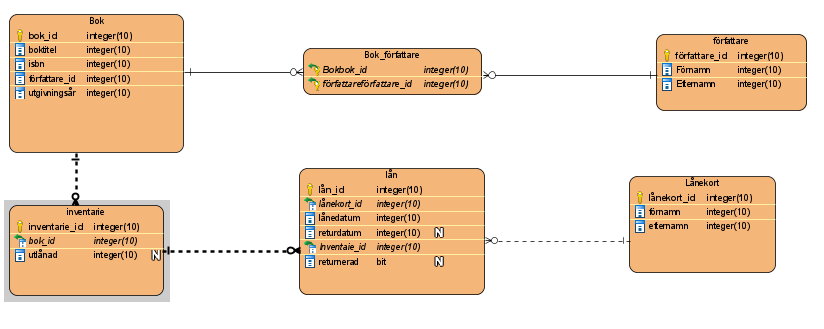

# Centrumbibliotekets API

Cetrumbibliotekets API är ett webb API med en simpel vy som ger dig information om låntagare med försenade lån. 
 APIns uppgift är att agera mellanhand mellan en webbsida eller ett program som har någon typ av användargränssnitt och en databas. APIet tar alltså både emot och skickar information mellan båda parterna beroende på om datan vill hämtas ut eller sparas/redigeras. 

# Funktioner
##### Färdiga metoder för:
 - Lån av bok
 - Returnering av bok

##### Tar emot och hantarar data för:
  - Böcker
  - Författare
  - Lånekort och låntagare
  - Lån av böcker
 
##### Vy för försenade lån
i Med programmet ingår en webbaserad vy som kollar om det finns försenade lån och visar dem som en lista
Vyn innehåller:

-  Lista med alla låntagare som har böcker som ej lämnats tillbaks innan returdatum
-  Lista inehållande alla böcker som ej lämnats tillbaks innan returdatum
-  Specifik lista för låntagare som visar alla dess försenade böcker
-  Information om låntagaren som behövs för kontakt

# Användning

##### Vy

För att komma åt listan krävs endast att du sufar in på utsatt webblänk och en lista med låntagare kommer att vara det första du ser. På sidan finns även en läng till alla försenade lån, samt en länk efter varje person i listan som kommer att visa en lista av alla deras försenade böcker. 

URL för vyn kommer att bestämmas vid produktionssättning. Instruktioner för detta medföljer i separat dokument. 

##### API
API:et tar emot data av typen JSON med CRUD(Create, Read, Update, Delete) funktionalitet. 
Det finns alltså möjlighet att Skapa data, läsa av data, ändra existerande data och ta bort data som följer strukturen enligt programmets modeller. 

# Teknik

Programmet är utvecklat i Visual Studio med språket C#.

Projectet är skapat i asp.net Core version 3.1 Med Entity Framework.

Kodens Upplägg är baserat på entity frameworks "Code First" Vilket innebär att 
Databasen byggs efter hur modellerna i Apiet är uppbyggt.

### Instruktioner

##### Modeller 

I projektet finns en modell för varje Entitet, dvs Bok, författare, lånekort, lån, index samt en modell för kopplingstabbelen mellan bok och författare. Kopplingstabellen BookAuthor är den enda many to many relationen i API:et, och eftersom vi använder v.3.1 av asp.net så sätts relationens nycklar I modelbuilder metoden i dbcontext filen. De andra modellerna har one to many relationer och nycklarna skapas automatiskt genom navigations propertiesen som ligger i modellerna. 

##### Controllers 

Alla modeller i projektet har varsin API controller med CRUD funktionallitet. Alla är scuffoldade med Entity Framework och ser i princip likadana ut. De skickar ut och tar emot JSON data. 

I Card controllern ligger dock två handskrivna metoder för att låna och lämna tillbaks böcker. Lånemetoden kollar om boken är tillgänglig, och är den det skapar en ett nytt lån och sätter ut lånedatum sam datum då boken skall vara tillbaks 

Returmetoden kollar om boken är utlånad och sätter sedan ett returdatum. 

Det finns även en separat controller för den inbyggda webb vyn som heter “Rented”. Som plockar upp data för de olika listorna som kan visas på sidan. 

##### ConnectionString 

API:ets Connectionstring är utsatt till en lokal databas med Windows authentication. Den kommer att behöva ändras beroende på vilken typ av databas som ska användas. Om databasen har en egen användare med lösenord måste det också finnas med i API:ets connectionstring.
